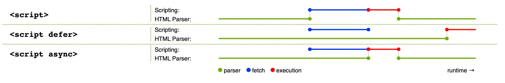

# 页面加载

## [页面渲染 工作原理](https://developer.mozilla.org/zh-CN/docs/Web/Performance/How_browsers_work)
1. 导航
2. DNS查询
3. TCP三次握手
4. TSL协商
5. 响应(建立连接,发送请求, 响应请求)
6. 构建DOM树
    dom树描述了文档内容, <html>为根节点

## script 标签的 async 和 defer
**async**: 异步加载，加载完成后立即执行, 执行会阻塞页面渲染

**defer**: 异步加载，加载完成后在 DOMContentLoaded 事件后执行(推荐使用)

事件: DOMContentLoaded

    页面dom解析完成,在loaded之前,资源文件可能未加载完成,例如img未加载

事件: loaded

    页面dom解析完成,资源文件加载完成

